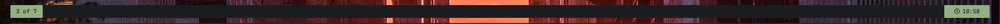
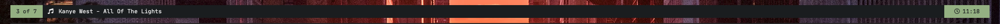
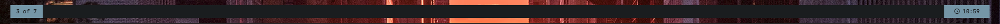
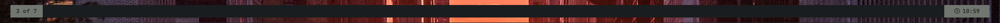
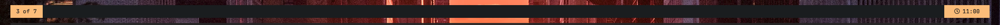
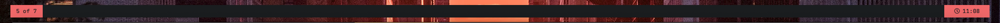
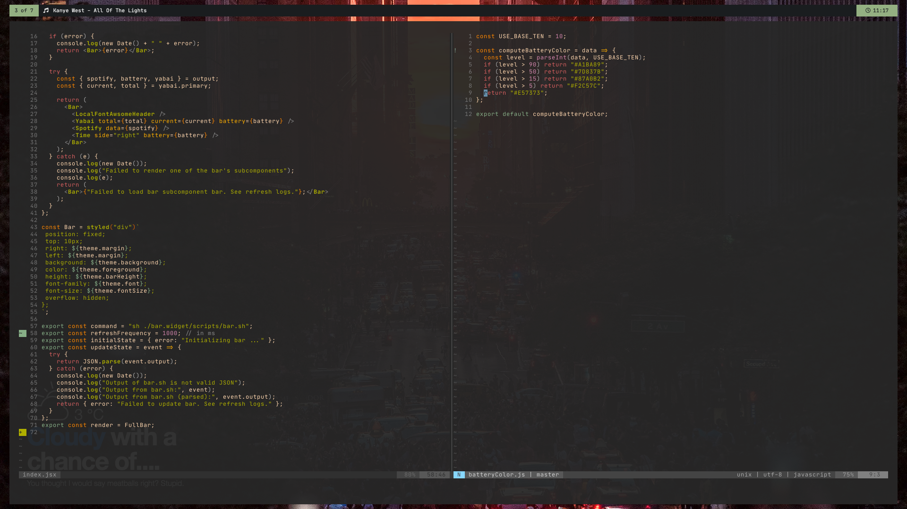

# Status Bar

This is the minimal status bar that I have at the top of my screen when I am using the [yabai tiling window manager](https://github.com/koekeishiya/yabai) (which, given that yabai is helpful, is almost always). It's an simple [ubersicht widget](tracesof.net/uebersicht/). On the left side it shows which workspace I am in and on the right side it shows the current time.

It shows me the name of the song that is currently playing on Spotify.

As my battery diminishes throughout the day, the bar changes between five colors (green, blue, grey, orange, red) so that I have a rough estimate on the amount of charge left. 

This is how it looks on my screen:

### What is it doing behind the scenes?

There are two scripts in the scripts folder that poll the yabai API and my local instance of spotify for the information that it need. Later I might change this to read from a websocket, but for now I don't notice any performance problems. Only a nice clean bar at the top of my screen.